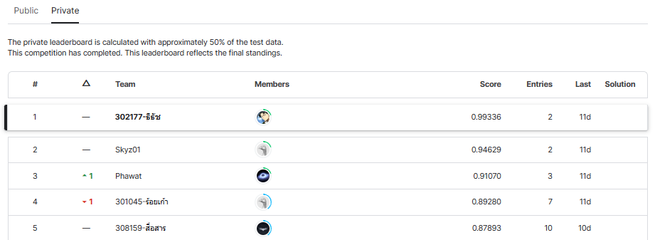

# superai3-Thai_silk_pattern_recognition

Hackathon Online: Thai silk pattern recognition is a part of the Super AI Engineer Season 3 Online Hackathon. The objective of this hackathon is to solve an image classification problem related to Thai Silk Pattern that have 4 classes.
 

My solution for the Thai Handwritten Characters Recognition Hackathon uses the state-of-the-art model EVA02,using 10-fold training and mixup augmentation techniques on the training dataset. I am proud to say that my notebook achieved 1st place out of 40 participating teams.
 

LB score 0.98064 #1
PB score 0.99336 #1
 

